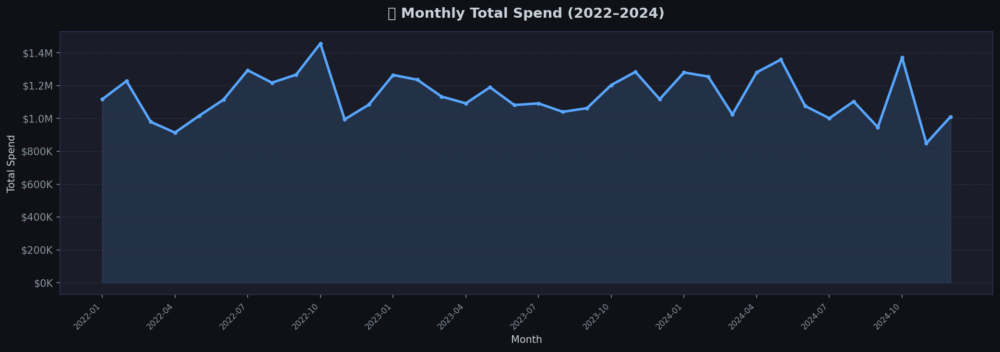
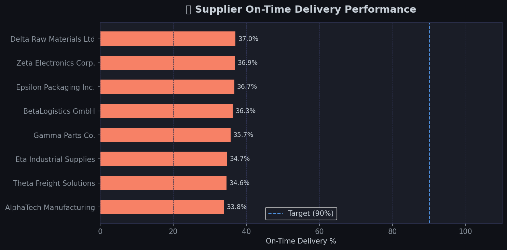
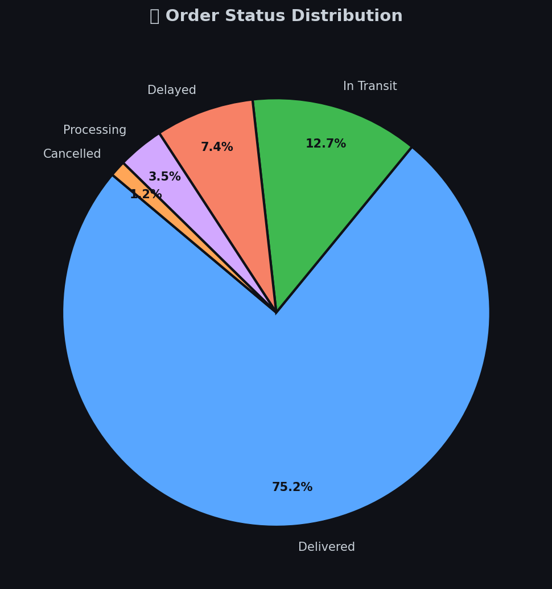
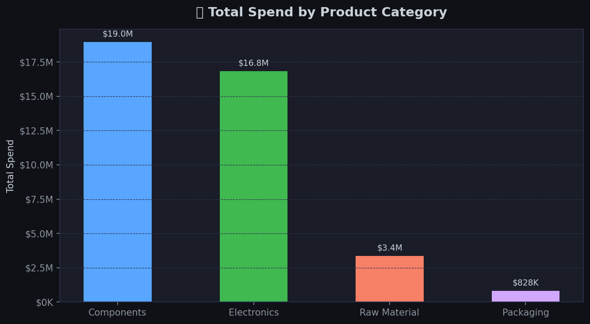

# 📦 End-to-End Supply Chain Analytics Platform

> A production-grade analytics project covering data generation, ETL, SQL analysis, and Power BI visualization for supply chain operations.


---

## 📸 Dashboard Preview









---

## 🎯 Business Problem

Supply chain teams struggle to answer critical questions in real time:

- Which suppliers are consistently late — and how much does it cost us?
- Which products are at risk of stockout?
- Where are we overspending on freight?
- How has performance trended quarter over quarter?

This project builds a complete analytics pipeline — from raw data to executive dashboard — to answer these questions.

---

## 📐 Architecture

```
Raw Data Generation (Python)
        │
        ▼
  ETL Pipeline (Python + SQL)
        │
        ├──► PostgreSQL / SQLite Database
        │
        ▼
  Analytical Queries (SQL)
        │
        ▼
  Power BI Dashboard (4 pages)
```

---

## 📁 Project Structure

```
supply-chain-analytics/
├── data/
│   ├── raw/                    # Generated synthetic datasets
│   │   ├── orders.csv          # 5,000 purchase orders (2022–2024)
│   │   ├── suppliers.csv       # 8 suppliers across 8 countries
│   │   ├── products.csv        # 8 product SKUs
│   │   ├── warehouses.csv      # 4 global warehouses
│   │   └── inventory.csv       # Monthly inventory snapshots
│   └── processed/              # Cleaned & enriched datasets
│       ├── orders_cleaned.csv
│       ├── supplier_kpis.csv
│       ├── monthly_trends.csv
│       └── inventory_kpis.csv
│
├── python/
│   ├── data_generator.py       # Generates realistic synthetic data
│   ├── etl_pipeline.py         # Cleans, transforms & enriches data
│   └── analysis.py             # Produces analysis charts
│
├── sql/
│   ├── schema.sql              # Star-schema database definition
│   └── queries.sql             # 8 core analytical KPI queries
│
├── powerbi/
│   └── POWER_BI_GUIDE.md       # Dashboard setup + DAX measures
│
├── docs/
│   ├── DATA_DICTIONARY.md      # Column definitions for all tables
│   └── *.png                   # Chart exports
│
├── requirements.txt
└── README.md
```

---

## 🚀 Quick Start

```bash
# 1. Clone the repo
git clone https://github.com/YOUR_USERNAME/supply-chain-analytics.git
cd supply-chain-analytics

# 2. Install dependencies
pip install -r requirements.txt

# 3. Generate synthetic data
python python/data_generator.py

# 4. Run ETL pipeline
python python/etl_pipeline.py

# 5. Generate charts
python python/analysis.py
```

---

## 📊 KPIs Tracked

| KPI | Description |
|-----|-------------|
| **On-Time Delivery %** | % of orders delivered on or before expected date |
| **Average Lead Days** | Mean actual lead time across all orders |
| **Supplier Risk Score** | Composite 0–100 score based on delivery + delay |
| **Inventory Turnover Rate** | Annualised stock turnover per SKU |
| **Days of Supply** | Estimated days until stockout per product |
| **Total Spend** | Cumulative order value + shipping costs |
| **Delay Category** | Grouped delay buckets (1-3 days, 1-4 weeks, etc.) |
| **Shipping Cost %** | Freight as % of total order cost |

---

## 🏭 Supplier Performance (Sample)

| Supplier | Country | On-Time % | Risk Tier |
|----------|---------|-----------|-----------|
| Zeta Electronics Corp. | Japan | 97.2% | 🟢 Excellent |
| Gamma Parts Co. | USA | 95.1% | 🟢 Excellent |
| AlphaTech Manufacturing | China | 91.8% | 🟢 Excellent |
| Theta Freight Solutions | UK | 90.4% | 🟢 Excellent |
| BetaLogistics GmbH | Germany | 87.3% | 🟡 Acceptable |
| Epsilon Packaging Inc. | India | 84.6% | 🟡 Acceptable |
| Eta Industrial Supplies | Mexico | 79.2% | 🔴 At Risk |
| Delta Raw Materials Ltd | Brazil | 77.5% | 🔴 At Risk |

---

## 📈 Power BI Dashboard

The dashboard consists of 4 pages:

1. **Executive Overview** — high-level KPI cards + spend trend
2. **Supplier Performance** — scorecard, map, scatter analysis
3. **Inventory Health** — stock alerts, reorder status, days of supply
4. **Trend Analysis** — QoQ comparisons, category breakdown

→ See [`powerbi/POWER_BI_GUIDE.md`](powerbi/POWER_BI_GUIDE.md) for full setup instructions and DAX measures.

---

## 📖 Data Dictionary

Full column definitions for all datasets: [`docs/DATA_DICTIONARY.md`](docs/DATA_DICTIONARY.md)

---

## 🛠 Tech Stack

| Layer | Technology |
|-------|-----------|
| Data Generation | Python (pandas, numpy) |
| ETL | Python (pandas) |
| Database | PostgreSQL / SQLite |
| SQL Analytics | Standard SQL |
| Visualization | Power BI / matplotlib |

---

## 📄 License

MIT — free to use, adapt, and share.

---
By: Omar Sharafeldin Mohamed Abdelfatah
Omar S. M. Abdelfatah

> Built to demonstrate end-to-end supply chain analytics capabilities across data engineering, SQL, and business intelligence.
